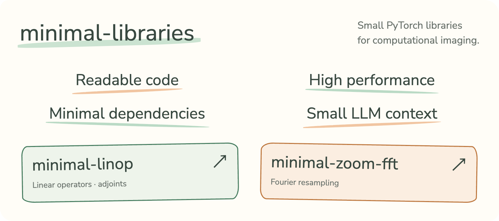

# Minimal libraries



Small PyTorch libraries for computational imaging, each focused on one task, with
concise, readable code and high performance.

As more code is written by LLMs, these libraries aim to provide reliable reference
implementations that are easy to read, check and learn from. Explicit mathematical
conventions, tests and tutorial notebooks support both practical use and teaching.

The minimal structure also makes them easy to import into larger codebases and
saves context tokens when LLMs need to inspect their implementations.

## Libraries

| Library | Purpose |
|---|---|
| [minimal-zoom-fft](https://github.com/jon-dong/minimal-zoom-fft) | Zoomed FFT by the chirp Z-transform, with its adjoint. |
| [minimal-linop](https://github.com/jon-dong/minimal-linop) | Linear operators with exact adjoints, composable with `@`, `+`, `*` and `.H`. |

More libraries will be added.

## Install

```bash
pip install minimal-zoom-fft
pip install minimal-linop
```

Python 3.10 or later and PyTorch 2.0 or later, with no other mandatory runtime
dependencies.

## Layout

```text
minimal-<name>/
├── README.md               purpose, install, quick start, API, conventions, manifest
├── pyproject.toml          version, torch; `test` and `notebooks` extras
├── .github/workflows/      tests on every push, PyPI on a version tag
├── src/minimal_<name>/     the implementation, plain versions first
├── notebooks/              01 tutorial, 02 details, 03 benchmark
└── tests/                  pytest; the README and the notebooks run as tests
```

The last section of each README is a manifest: purpose, dependencies, size, origin,
provenance, version and license.

## Inspirations

This collection draws inspiration from the following projects:

| Project | Focus |
|---|---|
| [GlobalBioIm](https://github.com/Biomedical-Imaging-Group/GlobalBioIm) | Imaging operators, cost functions and optimization in MATLAB. |
| [DeepInverse](https://github.com/deepinv/deepinv) | Imaging inverse problems and deep learning in PyTorch. |
| [Pyxu](https://github.com/pyxu-org/pyxu) | Operator algebra and optimization for computational imaging in Python. |
| [PyLops](https://github.com/PyLops/pylops) | Matrix-free linear operators and inverse problems in Python. |

## Feedback

Feedback, bug reports and suggestions are welcome. Open an issue in the relevant
library's repository or contact [Jonathan Dong](mailto:jonathan.dong@epfl.ch).

## License

MIT. Jonathan Dong, EPFL.
